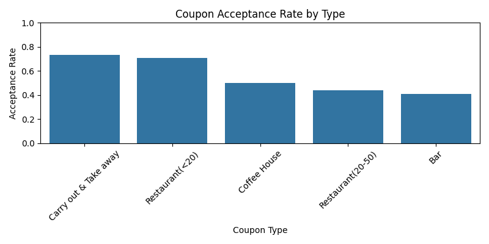
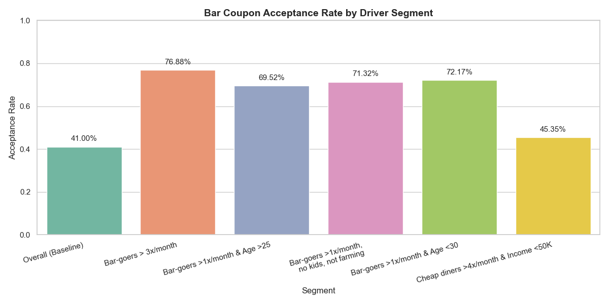
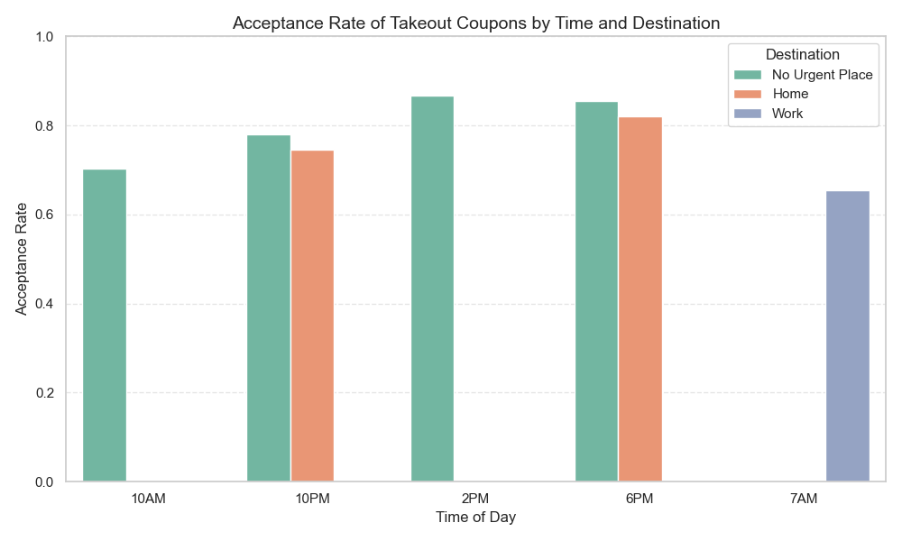
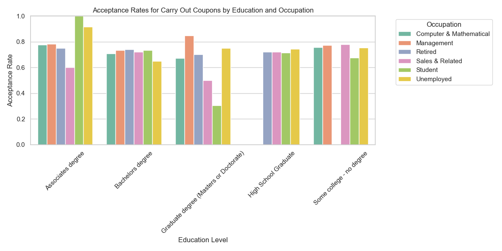

# Coupon Acceptance Analysis

## Project Overview

This project examines a dataset collected from a survey on Amazon Mechanical Turk to investigate the factors that influence whether a driver accepts a coupon delivered to their mobile device. The dataset includes information about the driver, the driving scenario, and the coupon offered.

The goal of this analysis is to identify the characteristics of drivers who are more likely to accept various types of coupons, enabling businesses to target their promotions more effectively.

## Data and Methodology

The analysis utilizes the `coupons.csv` dataset, which contains information on various attributes, including driver demographics (age, gender, income, etc.), contextual factors (time, weather, destination, and passenger), and coupon details (type and expiration).

The approach involved:
1.  **Data Loading and Inspection:** Loading the data and checking for missing values.
2.  **Data Cleaning:** Handling missing data by dropping a column with excessive missing values and imputing missing values in other relevant columns.
3.  **Overall Acceptance Rate:** Calculating the proportion of coupons accepted across the entire dataset.
4.  **Targeted Analysis:** Focusing on specific coupon types (Bar and Carry out & Take away) to identify key factors influencing acceptance within those categories. This involved comparing acceptance rates across different segments based on driver attributes and contextual factors, supported by visualizations.

## Key Findings

### Overall Coupon Acceptance

Approximately **56.84%** of the total coupon offers in the dataset were accepted by drivers.

**Visualization:**

  
*Figure: Distribution of coupon types and their acceptance rates.*

### Bar Coupon Acceptance

Acceptance rates for bar coupons are generally lower than the overall average, at **41.00%**. However, certain driver segments show significantly higher acceptance:

*   Drivers who visit bars **more than 3 times a month** have a much higher acceptance rate (**76.88%**).
*   A combination of factors, such as visiting bars frequently, being over the age of 25, not having kids as passengers, and having certain occupations, are associated with higher bar coupon acceptance (acceptance rates around **70-72%** for various combinations of these factors).

This suggests that bar coupons are most effective when targeted at individuals who already frequent bars and are in social or flexible driving situations.

**Visualization:**

  
*Figure: Acceptance rates for bar coupons across different driver segments.*

### Carry Out & Take Away Coupon Acceptance

Carry out & Take away coupons have a higher overall acceptance rate compared to bar coupons, at **73.55%**.

Key factors influencing the acceptance of these coupons include:

*   **Time of Day and Destination:** Acceptance rates are highest in the **afternoon (2 PM) and evening (6 PM)**, especially for drivers with **no urgent destination** or who are heading **Home**. Acceptance is lowest during the morning commute (7 AM, heading to Work).
*   **Education and Occupation:** Certain combinations of education levels (e.g., Associates degree, some college) and occupations (e.g., Protective Service, Construction, Healthcare Support, Business & Financial, Office & Administrative Support) show notably higher acceptance rates for takeout coupons.

This suggests that takeout coupons are more likely to be accepted when drivers are not on a strict schedule (such as a morning commute) and by individuals in certain professional and educational backgrounds who may find these offers convenient and appealing.

**Visualizations:**

  
*Figure: Acceptance rate of takeout coupons by time of day and destination.*

  
*Figure: Acceptance rates for takeout coupons by education level and occupation.*

## Actionable Insights and Recommendations

Based on this analysis, businesses can enhance their coupon targeting strategies:

*   **For Bar Coupons:** Focus advertising efforts on drivers who exhibit behaviors indicative of frequent bar visits and whose current driving situation and passenger type align with social or leisure activities (e.g., not with kids). Targeting individuals over 25 who visit bars regularly is a strong approach.
*   **For Carry Out & Take Away Coupons:** Deliver coupons during midday and evening hours, avoiding the typical morning work commute time. Prioritize drivers whose destination is 'Home' or indicates no urgent location. Consider targeting individuals in occupations and with education levels that showed higher acceptance rates in the analysis.

By utilizing these insights to target specific customer segments at the right time and in the proper context, businesses can significantly enhance the effectiveness of their coupon campaigns.

## Repository Contents

*   `coupons.csv`: The dataset used for the analysis.
*   `Practical Application 1 Jupyter Notebook.ipynb`: The Jupyter notebook containing all the code, analysis steps, visualizations, and detailed observations.
*   `README.md`: This file provides a non-technical summary of the project and findings.
*   `images/`: A directory containing image files of the visualizations (e.g., `overall_coupon_distribution.png`, `bar_coupon_acceptance_segments.png`, `takeout_time_destination_acceptance.png`, `takeout_education_occupation_acceptance.png`).

## Future Work

Further analysis could involve building a predictive model to forecast individual coupon acceptance based on a combination of factors. Exploring other coupon types and their unique influencing factors would also be beneficial.
